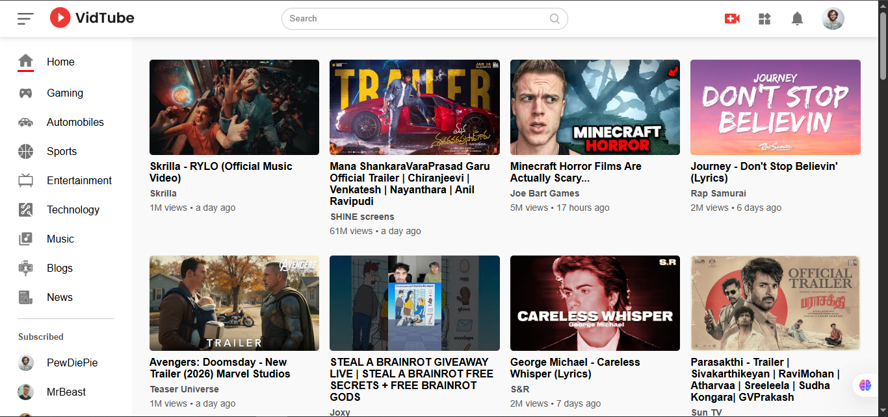
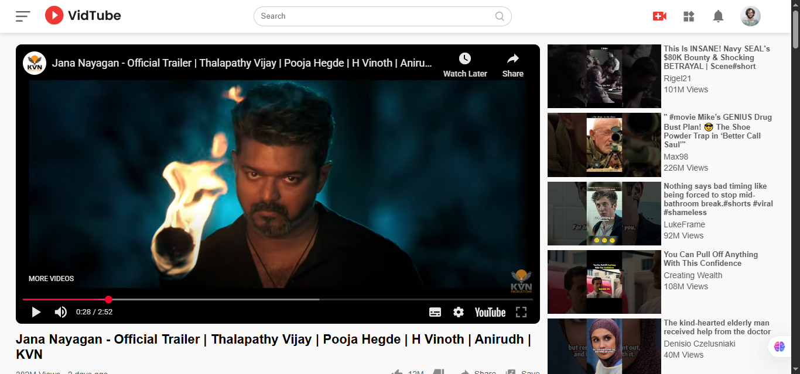
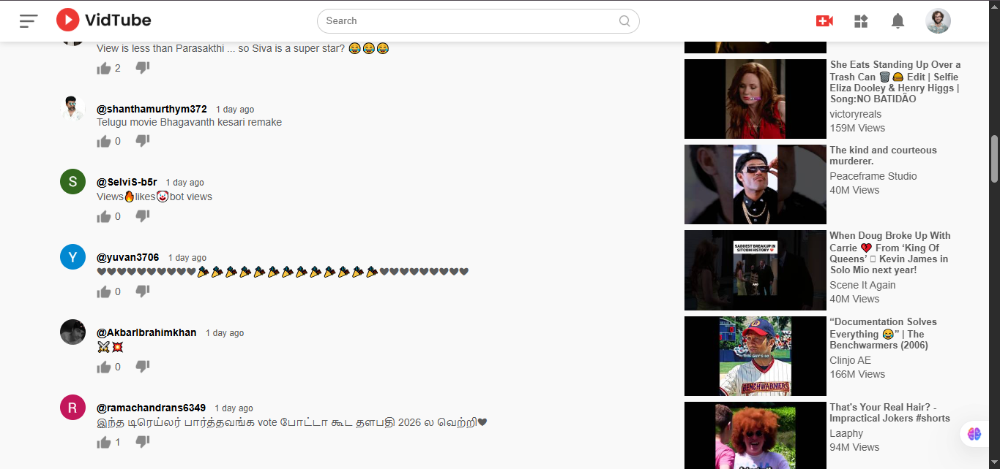
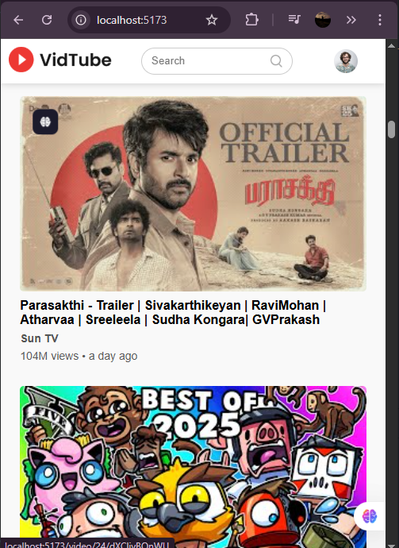
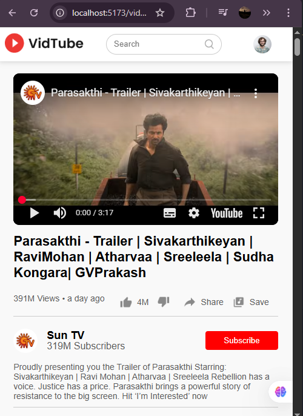

# 🎬 YouTube Clone – React Project

A fully functional **YouTube Clone** built using **React.js** that fetches **real YouTube data using the YouTube Data API**.  
This project replicates core YouTube features such as **video browsing, category-based feed, video playback page, comments, channel details, and recommended videos**.

---

## 🚀 Live Demo

🔗 **Netlify:** https://vidtubeclonereactjs.netlify.app/

---

## 🛠️ Tech Stack

- **React.js**
- **Vite**
- **React Router DOM**
- **YouTube Data API v3**
- **Moment.js**
- **CSS / Tailwind CSS** (if used)
- **Vercel** (Deployment)

---

## ✨ Features

### 🏠 Home Page
- Displays **real YouTube videos**
- Category-based filtering:
  - Home
  - Gaming
  - Entertainment
  - Sports
  - Music
  - News
  - Technology
  - and more
- Dynamic video feed similar to YouTube

---

### ▶️ Video Watch Page
When a user clicks on a video:
- Video plays instantly
- Shows:
  - Video title
  - Channel name
  - Subscriber count
  - Like count
  - View count
  - Published time (e.g. *2 days ago*)
- **Comments section**
- **Recommended videos sidebar**
- Clicking a recommended video updates the player dynamically

---

### ⏱️ Time Formatting
- Used **Moment.js**
- Shows time like:
  - `2 days ago`
  - `3 hours ago`
  - Similar to real YouTube UI

---

## 🧠 React Concepts Used

- `useState`
- `useEffect`
- `useParams`
- `react-router-dom`
- Component-based architecture
- API fetching & state management
- Conditional rendering

---

## 📸 Screenshots











---

## 🔐 Environment Variables

For security reasons, the **YouTube API key is stored in a `.env` file**.

### Create a `.env` file in root directory:

```env
VITE_YOUTUBE_API_KEY=your_youtube_api_key_here
```

---

## 📚 Learning Reference

This project was built while learning from a YouTube tutorial (reference: GreatStack) and further enhanced to strengthen practical understanding of React, API integration, and routing.


